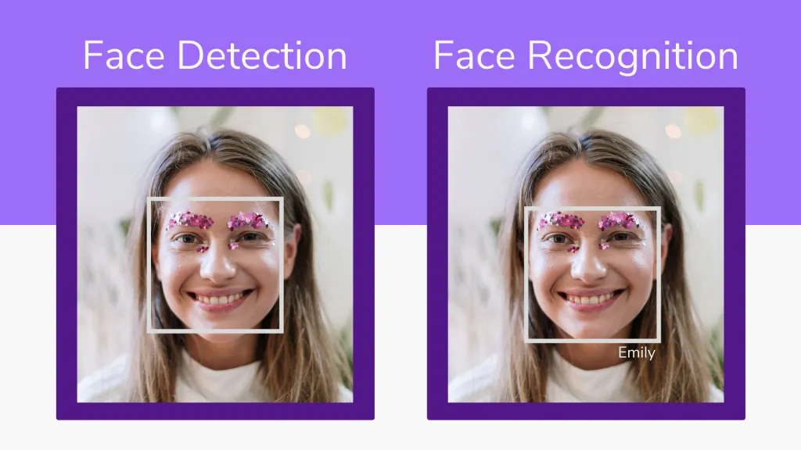

# Face Detection and Face Recognition System
<p float="center">
     
</p

```
Project Overview
```

This project is a computer vision system designed to perform face detection and face recognition. It detects human faces in images or video frames and identifies individuals by comparing extracted facial features with known identities.

The system is built using deep learning techniques and processes image data efficiently to extract meaningful facial representations known as embeddings.

## Features

- Face detection in images and video frames
- Face recognition using facial embeddings
- Support for multiple faces in a single image
- Processing of extracted video frames
- Modular pipeline for preprocessing, detection, and recognition
- Integration with deep learning frameworks for feature extraction

## Technologies Used

- Python
- OpenCV
- PyTorch
- torchvision
- NumPy

## Project Structure

project  
data  
images  
extracted_frames  
output_video.mp4  

models  
face_recognition_model.pth  

notebooks  
face_detection_pipeline.ipynb  

utils  
preprocess.py  
detect.py  
recognize.py  

README.md  

## Installation

Clone the repository

git clone https://github.com/your-username/face-recognition-project.git  
cd face-recognition-project  

Install dependencies

pip install -r requirements.txt  

## Usage

Face detection

python detect_faces.py --input data/images/sample.jpg  

Face recognition

python recognize_faces.py --input data/images/sample.jpg  

## System Workflow

The system loads input images or video frames. It then detects faces using a trained detection model. Each detected face is converted into a numerical embedding. These embeddings are compared with stored embeddings of known individuals to determine identity.

## Output

The system outputs images or videos with bounding boxes around detected faces and labels indicating recognized identities.

## Limitations

Performance may be affected by lighting conditions, occlusions, and low resolution images. Recognition accuracy depends on the quality and diversity of training data.
